## Figure Guide

### Research Question

Can the final state of a sequentially fine-tuned model reveal which task was learned most recently?

An order such as `A -> B -> C` means that the model is trained on A, then fine-tuned on B, and finally fine-tuned on C. The final sequential model is the checkpoint after the complete sequence. The actual last task is the final element of the order.

The direct fingerprinting figures compare each final sequential model with the single-task reference models, such as Single-A, Single-B, and Single-C. A black outline marks the reference corresponding to the actual last task. It is only a visual marker and does not represent another model.

### Representation Evaluation Mode and Figure Filenames

The representation-dependent figures state the active evaluation mode in their titles. The title identifies whether the scores use the fixed `probe` set or the `all_test` set, and includes the available sample and class counts.

Each diagram now has one stable filename. Running the plotting script again in another evaluation mode replaces the existing representation-dependent image with the newly generated one. Therefore, this guide needs only one path per diagram. The image title remains the source of truth for the mode represented by the current file.

## 1. Last-Task Prediction Accuracy

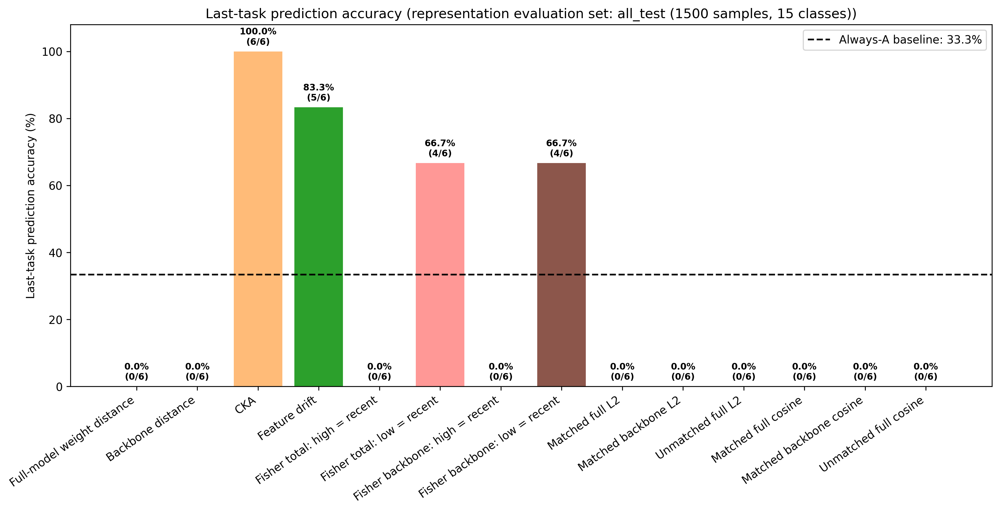

This is the main fingerprinting result. Each bar shows the percentage of sequential orders for which an experiment correctly predicted the actual last task. The label above each bar also reports the number of correct predictions out of all evaluated orders.

The diagram includes all available direct prediction experiments:

- Full-model weight distance
- Backbone weight distance
- CKA
- Feature drift
- Fisher total under both `high_is_recent` and `low_is_recent`
- Fisher backbone under both `high_is_recent` and `low_is_recent`
- Matched and unmatched weight comparisons for full-model L2, backbone L2, full-model cosine, and backbone cosine, where available

The dashed line is the computed always-one-task baseline for the loaded order set. Accuracy should be interpreted together with the prediction matrix and raw score diagrams.

## 2. Last-Task Predictions by Method

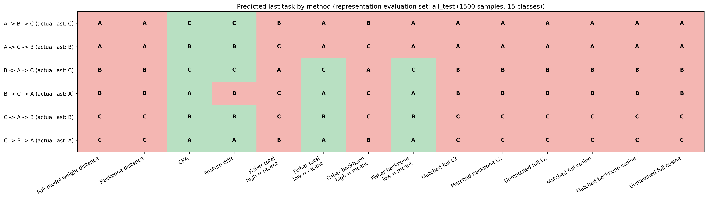

Each row is one sequential order, and its label states the actual last task. Each column is one available prediction experiment. The cells contain predicted task labels, not model identities or weights.

- Green means the prediction matches the actual last task.
- Red means the prediction is incorrect.

The matrix uses the stored `predicted_last_task` values. The plotting script does not derive new predictions or choose between Fisher hypotheses.

## 3. Weight-Distance Scores

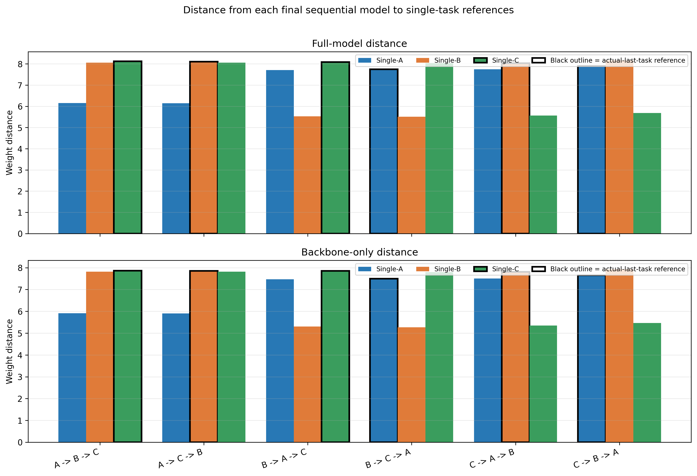

For every order, the same final sequential model is compared separately with each single-task reference. The upper panel uses all model parameters. The lower panel uses the shared backbone and excludes task-specific classifier heads.

The y-axis is Euclidean L2 weight distance. Lower distance means greater parameter similarity, so the prediction selects the reference with the smallest distance. The black outline marks the reference associated with the actual last task.

## 4. CKA Similarity

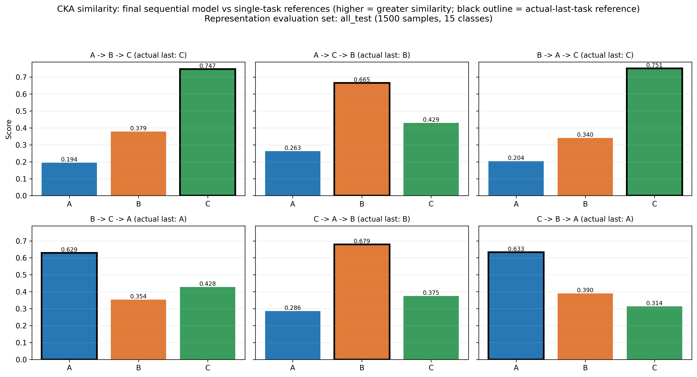

Each panel compares the representations of one final sequential model with the single-task references using the evaluation set named in the figure title.

Higher CKA means more similar representations, so the prediction selects the reference with the highest CKA. The black outline marks the reference associated with the actual last task.

## 5. Feature Drift

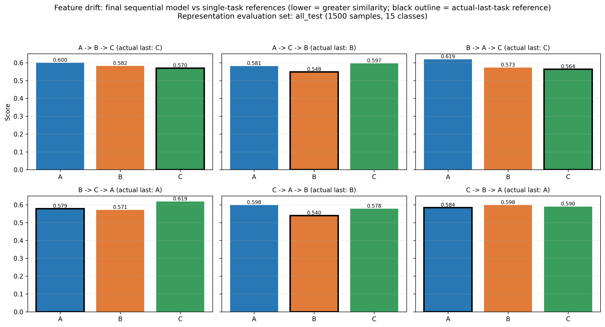

Feature drift is the mean L2 distance between normalized feature vectors. It uses the same configured representation evaluation set as CKA, and the active mode is printed in the title.

Lower feature drift means more similar representations, so the prediction selects the reference with the lowest drift. The black outline marks the reference associated with the actual last task.

## 6. Forgetting

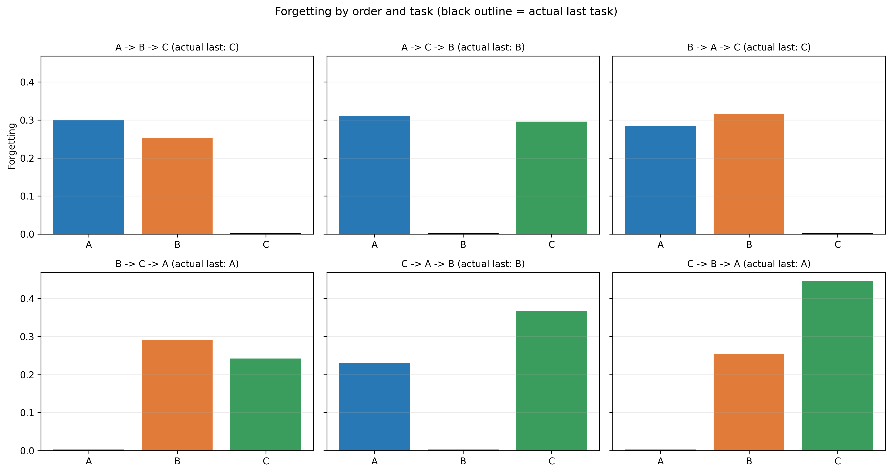

The project defines forgetting as:

`forgetting(task) = accuracy immediately after learning the task - final accuracy on the task`

Positive values mean performance decreased after later fine-tuning. Zero means unchanged accuracy. Negative values mean the final checkpoint performs better than the checkpoint immediately after that task was learned. Forgetting is supporting evidence about sequential-learning behavior, not a direct last-task classifier.

## 7. Fisher Information

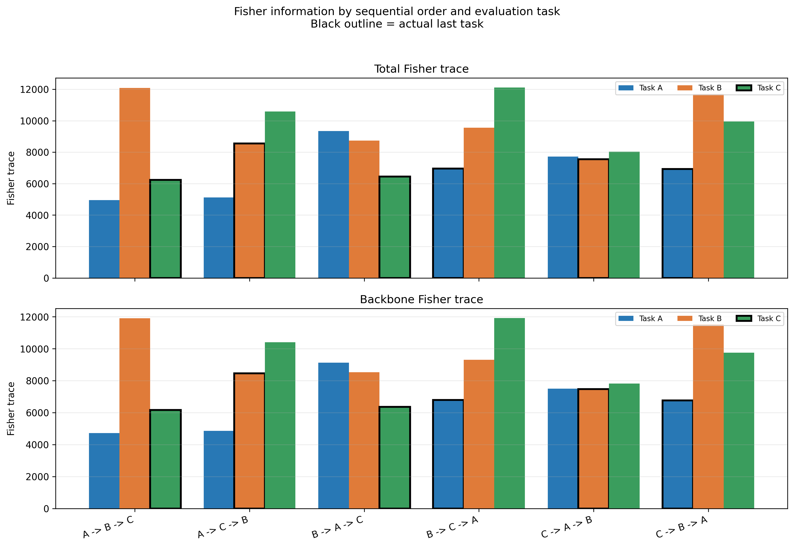

This figure shows the total and backbone Fisher traces for every task and final sequential model. Fisher measures how sensitive the model is to changes in its parameters for the evaluated task.

The raw Fisher values do not by themselves define whether a high or low value represents the most recent task. Therefore, both reading directions are evaluated explicitly.

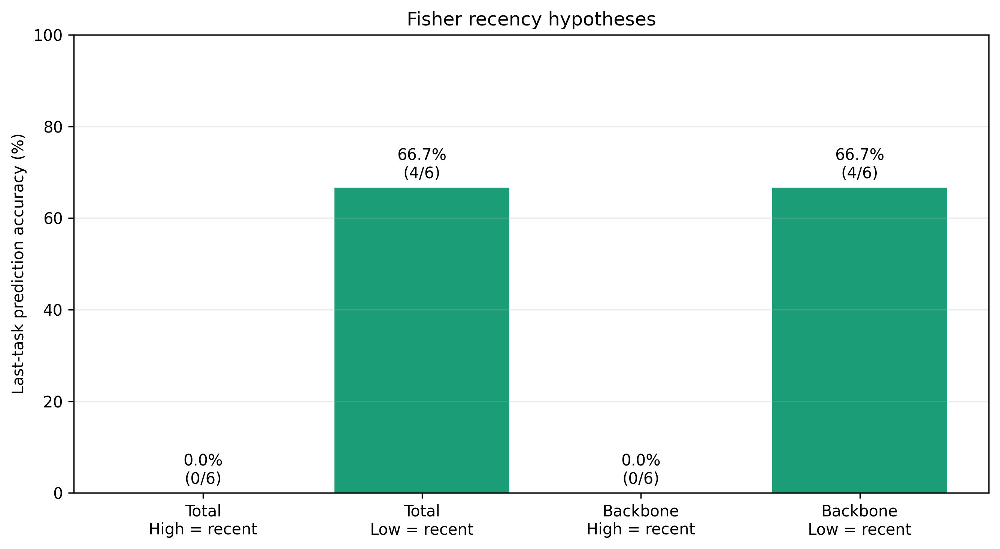

This figure compares the prediction accuracy of the `high_is_recent` and `low_is_recent` hypotheses for total Fisher and backbone Fisher. Neither direction is selected implicitly by the plotting script.

## 8. Weight Matching

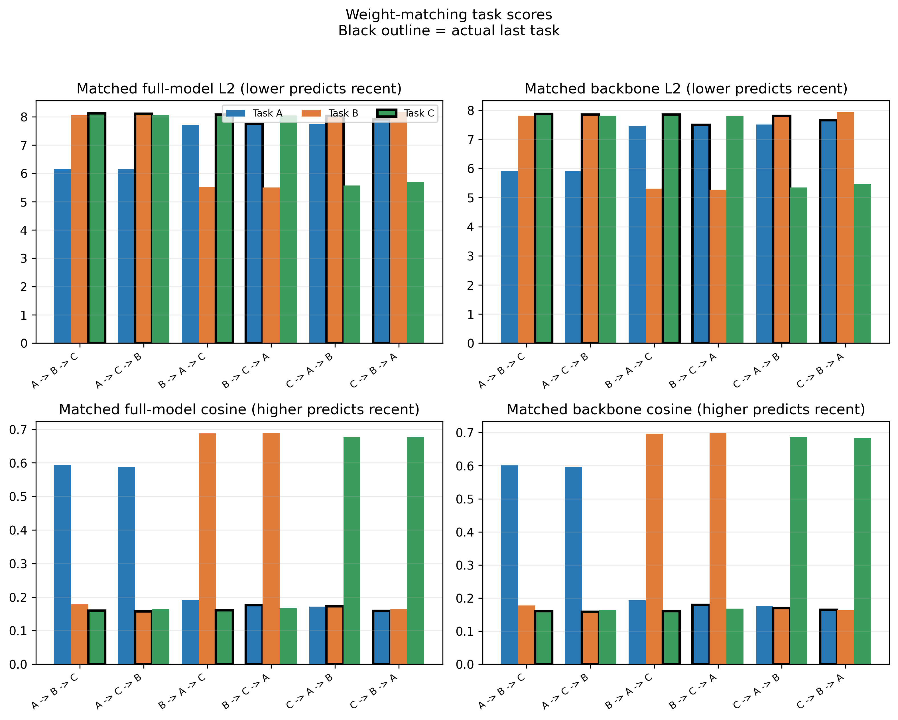

This figure shows the stored weight-matching comparison scores for the available references and orders. It includes the matched and unmatched L2 or cosine variants defined in the analysis results.

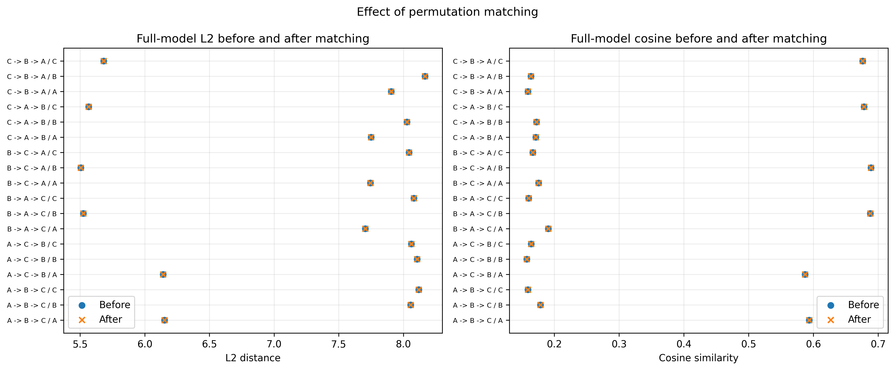

This figure compares full-model L2 distance and cosine similarity before and after permutation matching. It helps show whether alignment materially changes the relationship between the final sequential model and each single-task reference.

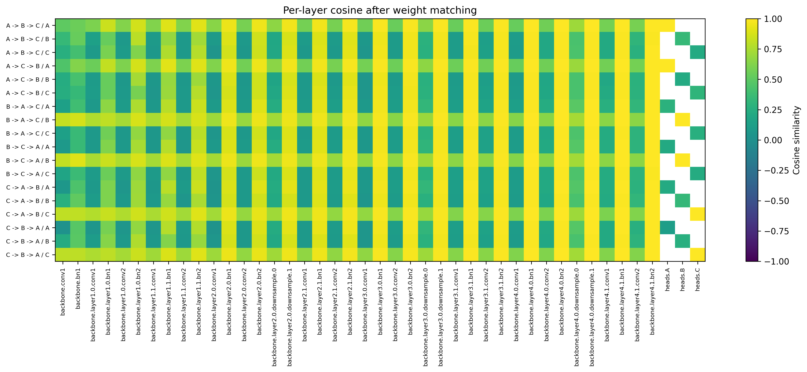

This optional weight-matching detail is generated when the raw weight-matching JSON is available. It shows cosine similarity by layer after matching.

## 9. Research Summary

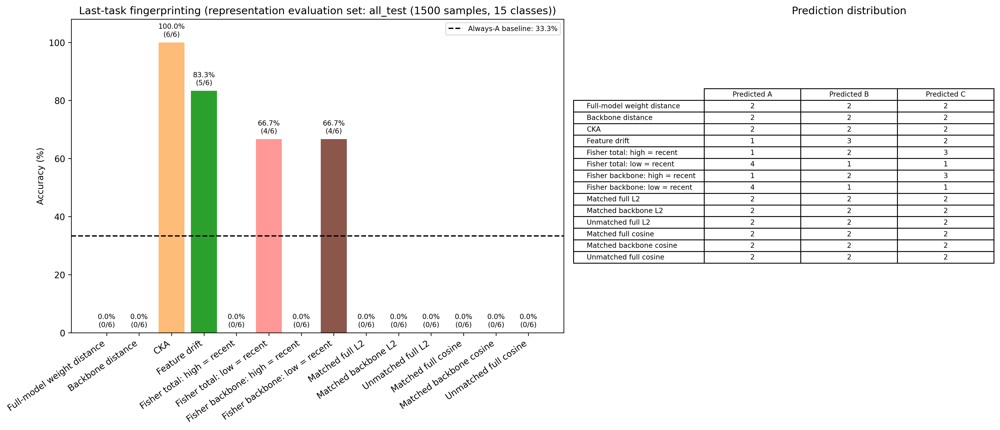

The summary combines the accuracy of every available prediction experiment with the computed baseline, correct-prediction counts, and the prediction distribution across tasks.

The prediction distribution is important because a useful method should identify different actual last tasks across different orders, rather than repeatedly selecting one task and only matching the baseline by chance.

## Example: C -> A -> B

C is learned first, A second, and B last, so the actual last task is B. The final sequential model is the checkpoint after all three stages.

In the weight-distance, CKA, feature-drift, Fisher, and weight-matching analyses, this final model is compared or evaluated using the stored task-specific results. Where a black outline is used, Single-B is outlined because B is the actual-last-task reference. The outlined item remains a comparison with a single-task reference.

## Overall Interpretation

Direct fingerprinting evidence comes from prediction accuracy, the prediction matrix, and the raw score diagrams for weight distance, CKA, feature drift, Fisher, and weight matching. Stronger evidence means accuracy above the computed baseline, predictions distributed according to the actual last tasks, clear numerical separation, and consistency across orders.

Forgetting, loss barriers, and Jacobian sensitivity are supporting diagnostics. They help explain model behavior but should not be treated as last-task classifiers unless an explicit and validated prediction rule is defined.

## 10. Optional: Loss Barriers

These figures are generated only when loss-barrier results are available for all required orders.

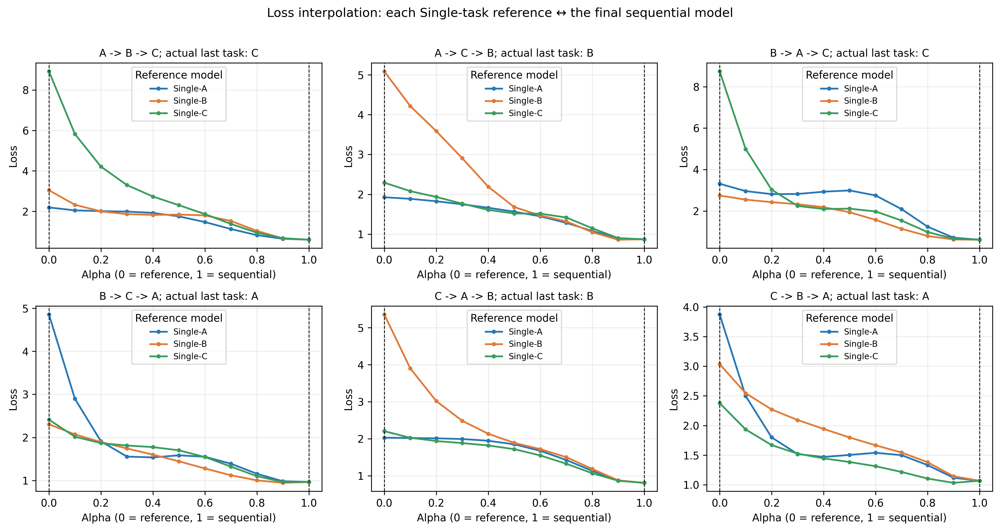

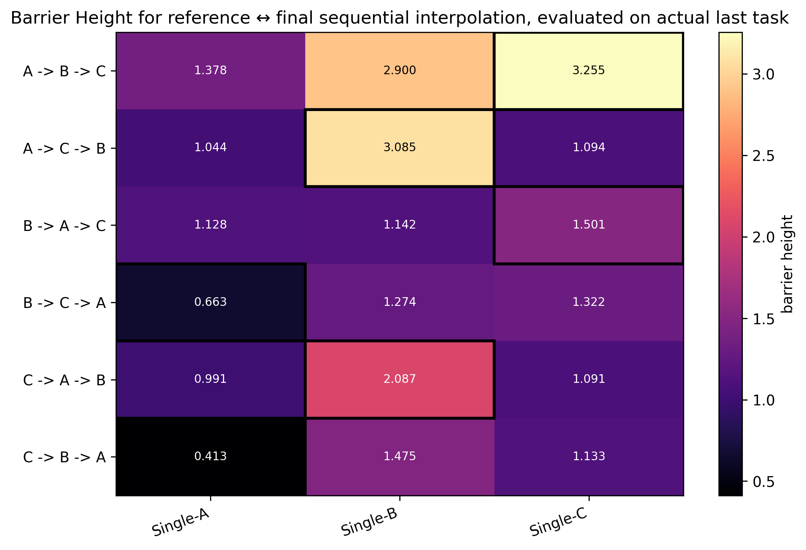

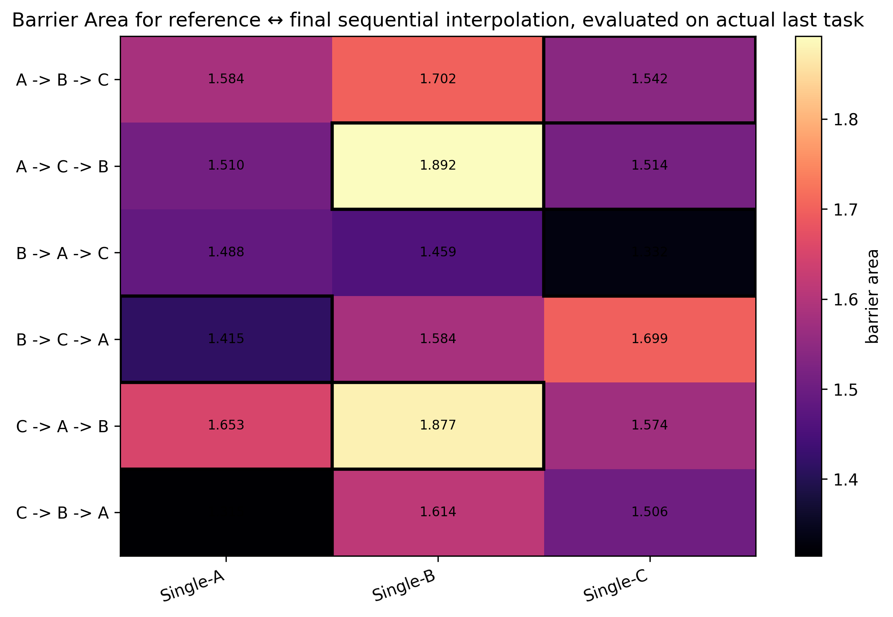

For each order, the final sequential model is interpolated separately with each single-task reference. The curves are evaluated on the actual last task for that order.

Barrier height is the maximum loss minus the minimum loss along the sampled interpolation curve. Barrier area is the trapezoidal area under the sampled loss curve. These figures describe loss-landscape relationships and are not direct last-task predictions.

## 11. Optional: Jacobian Sensitivity

These figures are generated only when Jacobian results are available for all required orders.

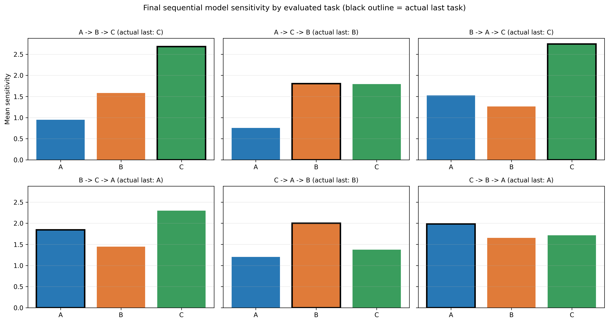

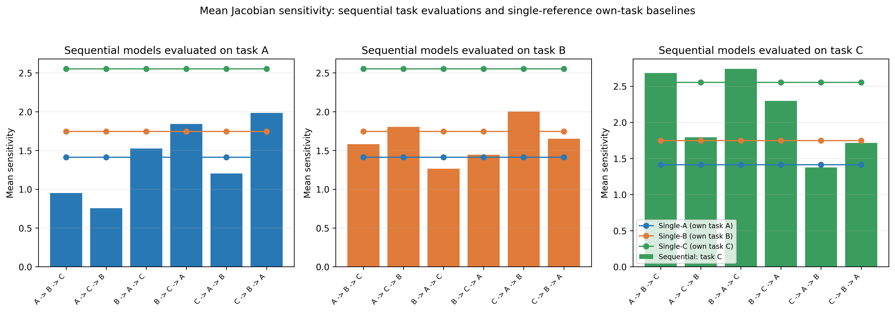

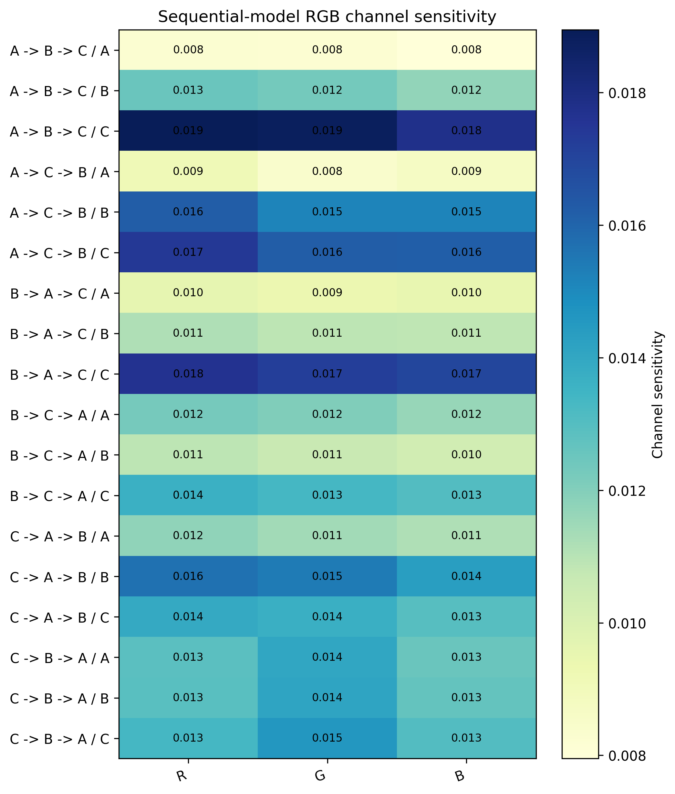

Mean sensitivity is computed from input-output Jacobians by differentiating the predicted-class logit with respect to each input image, calculating the gradient norm per image, and averaging across the analyzed batch.

The first figure compares task sensitivity for each final sequential model. The second compares sequential models with stored single-reference baselines. The channel heatmap reports mean absolute Jacobian magnitude for the R, G, and B input channels.

Higher sensitivity does not automatically mean that a task was learned more recently. These figures are diagnostic evidence, not fingerprint classifiers.
