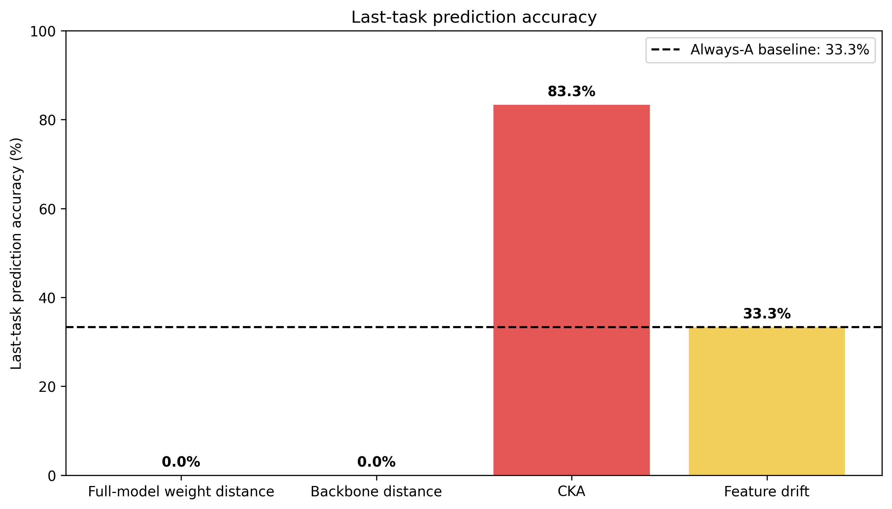
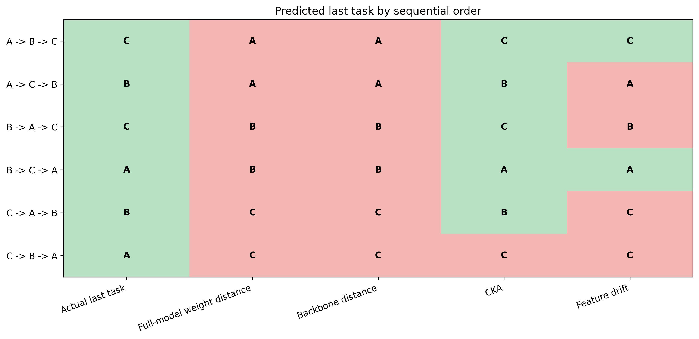
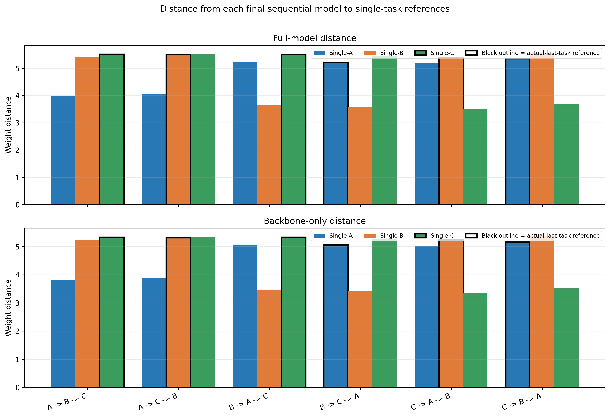
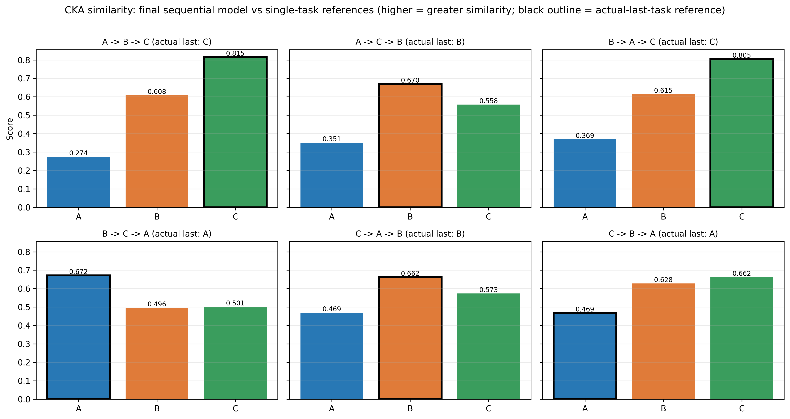
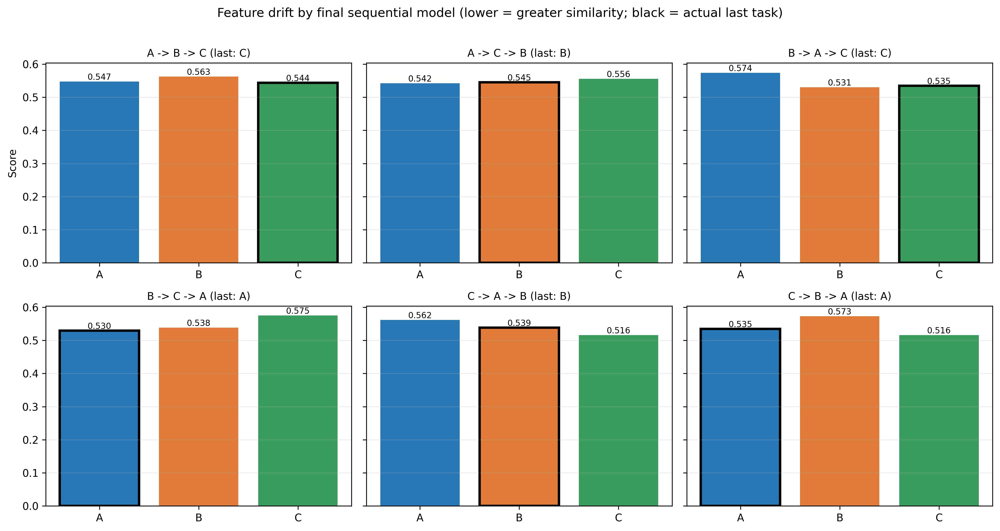
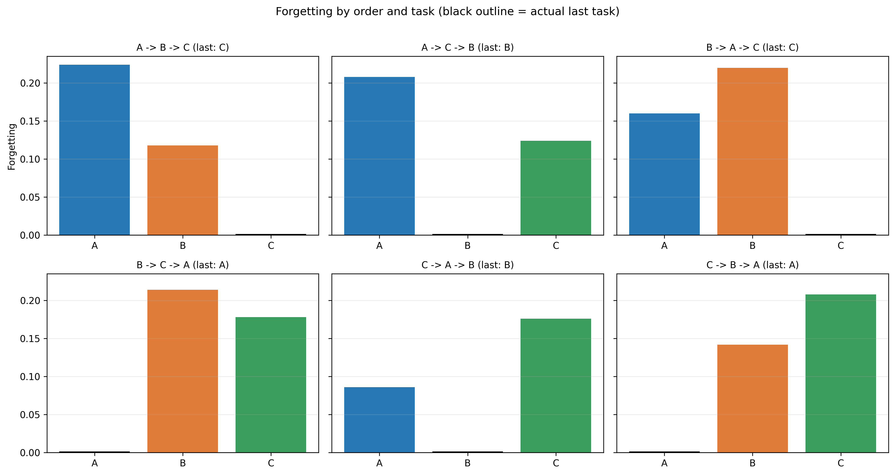
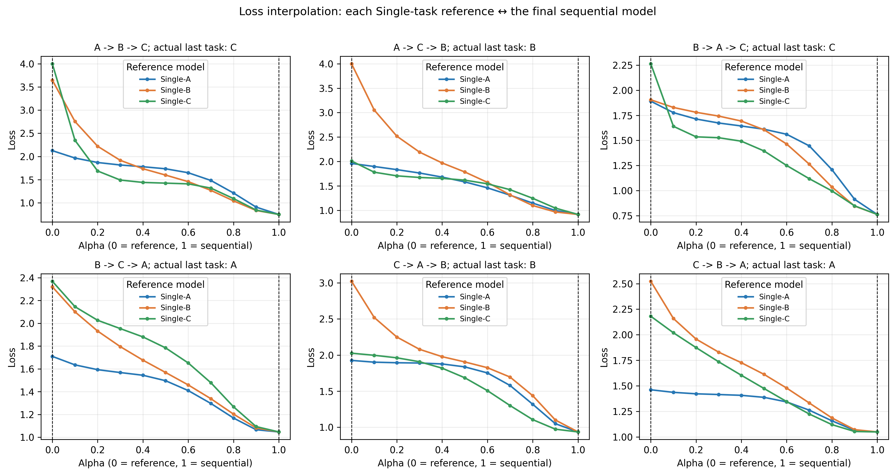
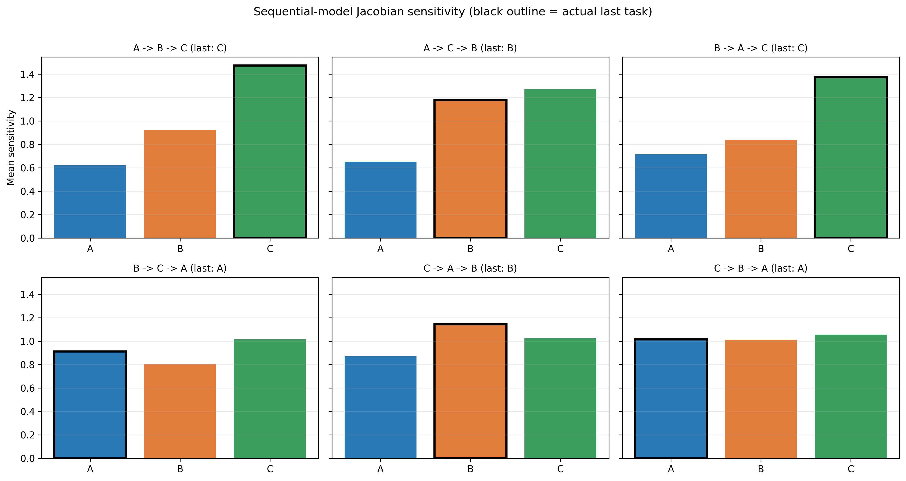
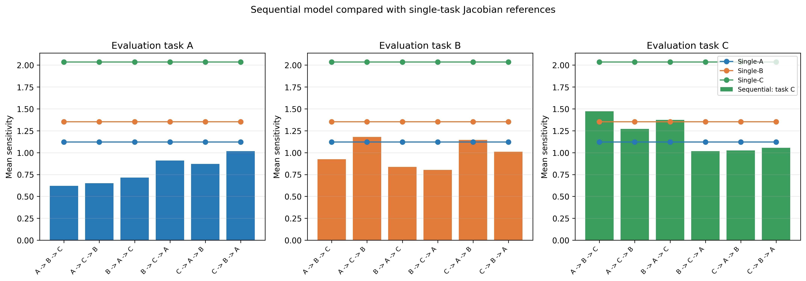
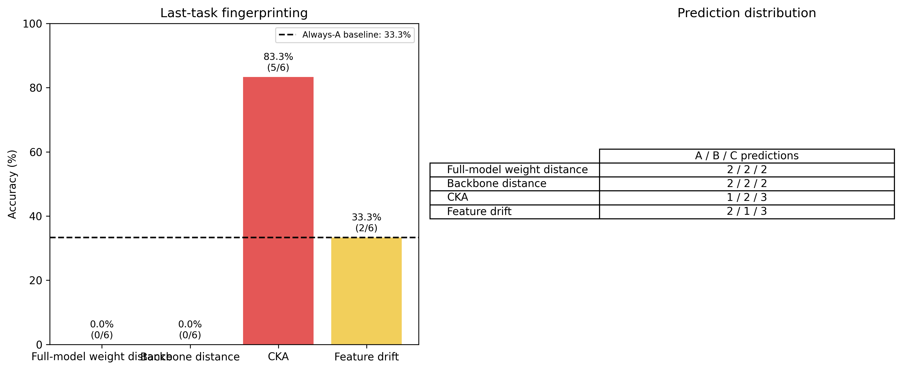

# Figure Guide

## Research Question

Can the final state of a sequentially fine-tuned model reveal which task was learned most recently?

A sequential order such as `A -> B -> C` means that the model is trained on A, then fine-tuned further on B, then fine-tuned further on C. The **final sequential model** is the checkpoint after the complete sequence. The **actual last task** is the final element of the order, `order[-1]`; for `A -> B -> C` this is C, and for `C -> A -> B` this is B.

The direct fingerprinting figures compare the final sequential model with single-task reference models. A `Single-A` model is trained only on task A, `Single-B` only on B, and so on. A black outline marks the task or single-task reference corresponding to the actual last task. The outline is a visual marker; it is not an additional model and it does not mean that the outlined bar is the sequential model.

## 1. Last-Task Prediction Accuracy



This is the main fingerprinting result. Each method predicts the most recent task for every final sequential model, and the bar height is the percentage of correct predictions across the evaluated orders.

The four methods are full-model weight distance, backbone weight distance, CKA, and feature drift. Weight-distance methods predict the single-task reference with the lowest L2 distance. CKA predicts the reference with the highest representation similarity. Feature drift predicts the reference with the lowest representation drift.

The dashed line is computed from the loaded orders as an always-one-task reference. For the current six-order experiment it is **Always-A: 33.3%**, because A is the actual last task in two of six orders. This is not a majority-class baseline; the current actual-last-task distribution is balanced. Accuracy above this line is potentially useful evidence, but with only six current orders it should be interpreted together with the prediction matrix and raw score plots.

## 2. Last-Task Predictions by Method



Each row is one sequential order. The actual last task is shown in the row label. The columns contain the task predicted by each fingerprinting method.

The cells contain task labels, not model identities or model weights. Green cells are correct predictions and red cells are incorrect predictions. 

## 3. Weight-Distance Scores



For each sequential order there is one final sequential model. That same final model is compared separately with every single-task reference:

```text
final sequential model
   |-- distance to Single-A
   |-- distance to Single-B
   |-- distance to Single-C
```

For example, in `C -> A -> B`, the final sequential model is the checkpoint after B. The three bars for that order are the distances from this one final model to `Single-A`, `Single-B`, and `Single-C`. The final sequential model itself is not one of the bars.

The x-axis lists sequential orders. The y-axis is Euclidean L2 weight distance. The upper panel uses all model parameters, including task heads; the lower panel uses only the shared backbone and excludes task-specific classifier heads. Colors identify the single-task reference. The black outline marks the reference whose task equals the actual last task.

Lower distance means greater parameter similarity, so the prediction rule selects the smallest bar for each order. The raw distances show whether a prediction is supported by a clear separation or only by a very small difference between references.

## 4. CKA Similarity



Each panel compares one final sequential model with the single-task reference representations on the fixed representation probe:

```text
CKA(final sequential model, Single-A)
CKA(final sequential model, Single-B)
CKA(final sequential model, Single-C)
```

The probe is the stored representation probe set and uses deterministic CIFAR-100 test images selected by the project. The x-axis is reference task and the y-axis is linear CKA. Colors identify reference tasks. The black outline marks the single-task reference corresponding to the actual last task.

Higher CKA means more similar representations, so the prediction rule selects the highest bar. A consistent pattern where the actual-last-task reference has the highest CKA would support the last-task fingerprinting hypothesis.

## 5. Feature Drift



This figure uses the same model relationship as the CKA figure, but the metric is feature drift:

```text
drift(final sequential model, Single-A)
drift(final sequential model, Single-B)
drift(final sequential model, Single-C)
```

Feature drift is implemented as the mean L2 distance between normalized feature vectors. The x-axis is reference task and the y-axis is feature drift. Colors identify reference tasks. The black outline marks the reference for the actual last task; for `C -> A -> B`, this is the `Single-B` comparison.

Lower drift means more similar representations, so the prediction rule selects the lowest bar. CKA and feature drift are related representation comparisons, but they are not identical measurements.

## 6. Forgetting



The project defines forgetting as:

```text
forgetting(task) = accuracy immediately after learning task - final accuracy on task
```

For an order `A -> B -> C`, the sequential evaluation code evaluates `A.pt`, `A_B.pt`, and `A_B_C.pt` on the tasks learned so far. For task A, forgetting is the accuracy of `A.pt` on A minus the accuracy of the final `A_B_C.pt` checkpoint on A. For task B, it is the accuracy of `A_B.pt` on B minus the final checkpoint accuracy on B. For task C, it is the accuracy of `A_B_C.pt` on C minus the final checkpoint accuracy on C.

Evaluation uses the task-specific CIFAR-100 test subset via `create_task_dataloader(..., train=False)`, deterministic test preprocessing, and the evaluated task identifier, which selects the corresponding task-specific head.

The x-axis is task and the y-axis is forgetting. Positive values mean performance decreased after later fine-tuning. Zero means unchanged accuracy. Negative values mean the final checkpoint performs better than the checkpoint immediately after that task was first learned. Forgetting is supporting evidence about sequential-learning dynamics, not a direct last-task classifier.

## 7. Loss Barriers




For each order, one final sequential model is interpolated separately with each single-task reference:

```text
Single-A  <->  final sequential model
Single-B  <->  final sequential model
Single-C  <->  final sequential model
```

For reference weights $W_R$ and final sequential weights $W_S$, the interpolation is:

$$W(\alpha) = (1 - \alpha) W_R + \alpha W_S.$$

Here, $\alpha=0$ is the single-task reference, $\alpha=1$ is the final sequential model, and intermediate values are interpolated weights. In the curve figure, all curves in a panel are evaluated on the actual last task for that order. For `C -> A -> B`, the final C->A->B model is interpolated separately with `Single-A`, `Single-B`, and `Single-C`, and all three curves use task B loss.

The heatmaps summarize the same reference-to-final-sequential comparisons. Rows are orders, columns are single-task references, and every value in a row is evaluated on that row's actual last task. The black outline marks the actual-last-task reference. The sequential model is involved in every cell of its row.

Barrier height is implemented as `max(losses) - min(losses)` along the sampled interpolation curve. Barrier area is implemented as trapezoidal area under the sampled loss curve. These figures support interpretation of loss-landscape relationships; they are not last-task classifiers because no prediction rule is defined for them.

## 8. Jacobian Sensitivity






For each order there is one final sequential model. In `jacobian_sensitivity_by_order.png`, that same model is evaluated separately on each task:

```text
same final sequential model
   |-- sensitivity on task A
   |-- sensitivity on task B
   |-- sensitivity on task C
```

Mean sensitivity is computed from input-output Jacobians. The implementation differentiates the predicted class logit with respect to each input image, flattens the gradient tensor, computes its L2 norm per image, and averages those norms across the analyzed batch. The Jacobian analysis uses up to the configured maximum number of CIFAR-100 test images per model and task.

In the first Jacobian figure, the x-axis is evaluated task and the y-axis is mean sensitivity. The black outline marks the actual last task. In `jacobian_vs_single_references.png`, each panel corresponds to one task evaluation for the final sequential models. The bars are final sequential models for each order, while the colored lines are single-reference own-task baselines as stored in the JSON. The channel-sensitivity heatmap has rows `order / task`, columns R/G/B, and values equal to mean absolute Jacobian magnitude for that input channel after averaging across images and spatial positions.

Higher sensitivity does not automatically imply that a task was learned more recently. These figures are diagnostic/supporting evidence, not fingerprint classifiers.

## 9. Research Summary



This compact overview repeats the direct fingerprinting accuracy results, the computed always-one-task reference line, the number of correct predictions out of the total evaluated orders, and each method's prediction distribution across tasks.

The prediction distribution is important. A method is more convincing if it identifies the actual last task across different orders, not if it repeatedly selects one task and happens to match a baseline.

## Example: C -> A -> B

C is learned first, A second, and B last, so the actual last task is B. The final sequential model is the checkpoint after all three stages.

In the weight-distance, CKA, and feature-drift figures, this one final C->A->B model is compared with `Single-A`, `Single-B`, and `Single-C`. The `Single-B` comparison is outlined because B is the actual-last-task reference. The outlined bar is still a comparison to a single-task reference, not the sequential model itself.

In the loss-barrier curves, the final C->A->B model is interpolated separately with `Single-A`, `Single-B`, and `Single-C`, while all three curves are evaluated using task B loss. In the Jacobian figure, the final C->A->B model is evaluated for sensitivity on tasks A, B, and C; B is highlighted because it was learned last.

## Current Combined-Analysis Observation

These observations are calculated from the current `results/combined/combined_analysis.json`; they are not general claims about future experiments.

- Sequential orders: 6
- Discovered tasks: A, B, C
- Actual last-task distribution: A=2, B=2, C=2
- Always-A reference accuracy for the current order set: 2/6 = 33.3%
- Full-model weight distance: 0/6 correct, 0.0% accuracy, predictions A=2, B=2, C=2
- Backbone weight distance: 0/6 correct, 0.0% accuracy, predictions A=2, B=2, C=2
- CKA: 5/6 correct, 83.3% accuracy, predictions A=1, B=2, C=3
- Feature drift: 2/6 correct, 33.3% accuracy, predictions A=2, B=1, C=3

## Overall Interpretation

Direct fingerprinting evidence comes from prediction accuracy, the prediction matrix, raw weight-distance scores, raw CKA scores, and raw feature-drift scores. Stronger evidence would mean accuracy clearly above the computed reference, predictions distributed according to actual last tasks, numerical scores consistently favoring the actual-last-task reference, and consistency across orders.

Weak evidence includes baseline-level accuracy, repeated prediction of one task, weak separation between reference scores, or strong disagreement between methods. Forgetting, loss barriers, Jacobian sensitivity, and RGB channel sensitivity should be used to explain model behavior rather than treated as classifiers. For the current six-order experiment, conclusions should remain cautious and should ideally be checked with additional tasks, orders, seeds, or reruns.
